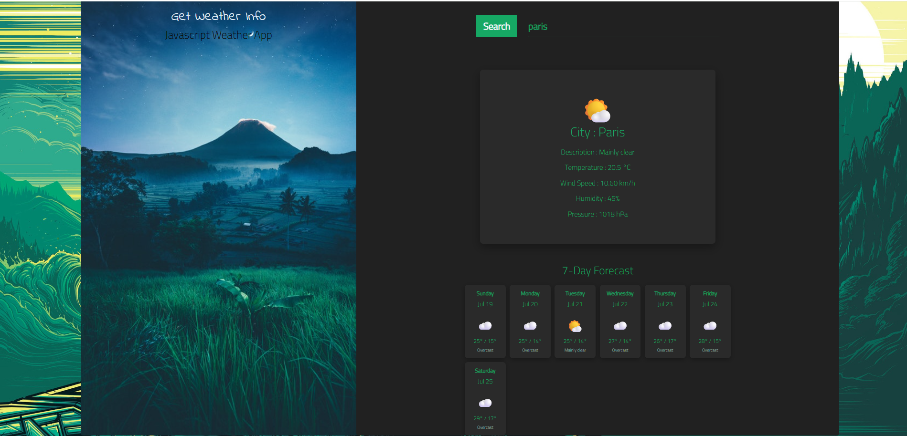

# 🌤️ Weather App

A simple, elegant JavaScript weather app with a 7-day forecast and animated weather backgrounds — built with vanilla HTML, CSS, and JavaScript (no frameworks, no build tools).



## ✨ Features

- 🔍 Search weather by city name (powered by free geocoding, works worldwide)
- 🌡️ Current conditions: temperature, description, wind speed, humidity, and pressure
- 📅 7-day forecast with daily highs/lows and dates
- 🎨 Animated background effects that change with the weather (rain, snow, drifting clouds)
- ⚠️ Friendly error handling for empty input, city not found, or network issues
- ⌨️ Search by pressing Enter or clicking the Search button
- 📱 Responsive layout for mobile and desktop

## 🛠️ Tech Stack

- HTML5, CSS3 (custom animations, Flexbox/Grid), vanilla JavaScript
- [Bootstrap 4.5](https://getbootstrap.com/) for grid layout
- Google Fonts (Indie Flower, Cairo)

## 🌐 APIs Used

This project uses **free, no-API-key** services:

- **[Open-Meteo](https://open-meteo.com/)** — current weather and 7-day forecast data
- **[Nominatim (OpenStreetMap)](https://nominatim.org/)** — geocoding (city name → coordinates)

No API keys, sign-ups, or billing information are required to run this project.

## 🚀 Getting Started

Since this is a static site (no build step), you just need a local server.

### Option 1: Python
```bash
python -m http.server 8000
```
Then open [http://127.0.0.1:8000](http://127.0.0.1:8000)

### Option 2: Node.js
```bash
npx http-server
```

### Option 3: VS Code Live Server
Right-click `index.html` → **Open with Live Server**

## 📁 Project Structure

```
Weather-App/
├── index.html      # Markup and layout
├── main.js         # App logic: geocoding, weather fetching, rendering
├── style.css        # Styling and animations
└── img/            # Background images
```

## 📝 Notes

- City names work best in English for the most reliable results.
- Rate limits: Nominatim allows up to 1 request/second, which is more than enough for personal use.

## ⚠️ Educational Project

This repository was created for learning purposes and does not represent production-quality code.
